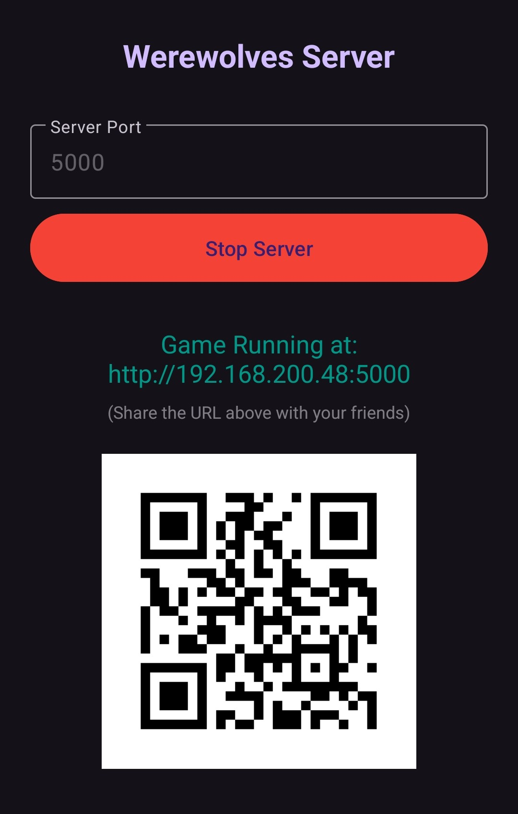

[🇺🇸 English](README.md) | [🇬🇹 Español](README.es.md)

Ein funktionsreiches, selbst gehostetes Echtzeit-Multiplayer-Spiel für soziale
Deduktion. Entwickelt mit Python (Flask) und WebSockets, hat sich dieses Projekt
von einem einfachen Experiment zu einem voll spielbaren Partyspiel entwickelt,
das 24 einzigartige Rollen, mobile "Pass-and-Play"-Unterstützung, mehrere
Sprachen und komplexe Siegbedingungen unterstützt.
[Installationsanleitung](#setup-und-ausführung) or Download server executable
for
[Linux(x86) and Android(apk)](https://github.com/davidchilin/werewolves_game/releases)

## **Beschreibung**

Dieses Projekt ist eine webbasierte Implementierung des klassischen Partyspiels
Werwölfe (Die Werwölfe von Düsterwald). Spieler (mindestens 4, idealerweise 7+)
treten einer Lobby mit einem einzigartigen Spielcode bei, erhalten geheim Rollen
zugewiesen (Dorfbewohner, Wolf oder Seherin) und durchlaufen dann abwechselnd
"Nacht"- und "Tag"-Phasen. Während der Nacht wählen die Wölfe heimlich einen
Spieler aus, um ihn zu eliminieren, und die Seherin kann die Rolle eines
Spielers untersuchen. Während des Tages diskutieren die Spieler und stimmen ab,
um jemanden zu lynchen, den sie für einen Wolf halten. Das Spiel unterstützt
komplexe Interaktionen: durch Amor verbundene Liebende, Kettenreaktions-Tode
(Honigtopf/Jäger), Rollen mit Solo-Sieg (Serienmörder/Narr) und einen
"Geistermodus", bei dem tote Spieler das Ergebnis noch beeinflussen können.

Das Spiel ist so konzipiert, dass es neben einem separaten Video- oder
Sprachchat (wie _Jitsi Meet_ oder Zoom) gespielt wird, wo die
Echtzeit-Diskussion und Täuschung stattfinden ODER persönlich unter Verwendung
von einem bis mehreren Geräten im **Pass-and-Play**-Modus.

## **Hauptfunktionen**


- **📱 Pass-and-Play-Modus:** Spielen Sie mit einem einzigen Telefon (oder
  mehreren), das im Raum herumgereicht wird. Die Benutzeroberfläche leitet die
  Spieler an, ihre Identität zu bestätigen, bevor ihr privater Rollenbildschirm
  angezeigt wird.
- **👻 Geistermodus:** Tote Spieler sind nicht nur Zuschauer. Wenn aktiviert,
  haben Geister eine kleine Chance, während der Anklage- und
  Lynch-Abstimmungsphase teilzunehmen.
- **🎭 24 Einzigartige Rollen:** Einschließlich komplexer Rollen wie
  **Alpha-Werwolf**, **Prostituierte**, **Anwalt** und **Serienmörder**.
- シ **Mehrere Sprachen** - Spielen Sie ein einzelnes Spiel gleichzeitig in
  mehreren Sprachen.
- **🏆 Solo-Siegbedingungen:** Neutrale Rollen wie das **Monster**, der **Narr**
  oder der **Demente Dorfbewohner** können alleine gewinnen und
  Teamzugehörigkeiten ignorieren.

- **Robuste Admin-Kontrollen:** Der erste Spieler, der beitritt, wird
  Administrator und hat die Fähigkeit:
  - Spieler aus der Lobby auszuschließen.
  - Das Spiel zu starten, sobald genügend Spieler beigetreten sind (mindestens
    4).
  - Benutzerdefinierte Zeitdauern (in Sekunden) für die Nacht-, Anklage- und
    Lynch-Abstimmungsphasen festzulegen.
  - Einen neuen Spielcode festzulegen.
  - Chat nur für Admins zu aktivieren.
  - **Pass-and-Play** und **Geistermodus** einzuschalten.
- **Persistente Sitzungen:** Spieler können ihren Browser aktualisieren oder
  kurzzeitig die Verbindung trennen, ohne ihren Platz im Spiel zu verlieren
  (obwohl der Timer möglicherweise inkorrekt ist).
- **Live-Spiel-Updates und Chat:** Die Benutzeroberfläche aktualisiert sich für
  alle Spieler in Echtzeit über WebSockets und zeigt Phasenwechsel,
  Spielerstatus, Spielchat und Spielprotokoll-Ereignisse an.
- **Dynamische Rollenzuweisung:** Zu Beginn des Spiels werden den Spielern
  zufällig und geheim Rollen zugewiesen.
  - Der "Zufällige Rollen"-Button berechnet eine ausgewogene Aufstellung
    basierend auf Rollengewichtungen (positiv für Dorfbewohner, negativ für
    Wölfe).
- **Automatischer Spielablauf & Siegbedingungen:** Das Spiel durchläuft
  automatisch die Phasen. Nach jedem Tod (durch einen Wolfsangriff, eine
  Lynch-Abstimmung) prüft das System auf Siegbedingungen:
  - **Dorfbewohner gewinnen:** Wenn alle Wölfe eliminiert wurden.
  - **Wölfe gewinnen:** Wenn die Anzahl der lebenden Wölfe gleich oder größer
    ist als die Anzahl der lebenden Nicht-Wölfe.
  - **🏆 Solo-Siegbedingungen:** Neutrale Rollen wie das **Monster**, der
    **Narr** oder der **Demente Dorfbewohner** können alleine gewinnen und
    Teamzugehörigkeiten ignorieren.
  - Wenn eine Siegbedingung erfüllt ist, wird allen Spielern ein "Game
    Over"-Bildschirm angezeigt, der das gewinnende Team, den Grund für den Sieg
    und eine Liste aller Spieler und ihrer finalen Rollen zeigt.

## **Spielphasen**


- **Nachtphase (Zeitgesteuert):**

  - Die Phase endet, wenn entweder der Timer abläuft ODER alle Wölfe und die
    Seherin ihre Aktionen eingereicht haben.
  - Nach den Aktionen der Nacht prüft das Spiel, ob eine Siegbedingung erfüllt
    wurde, bevor es fortfährt.

- **Anklagephase (Zeitgesteuert):**

  - Die Phase endet, wenn entweder der Timer abläuft ODER alle lebenden Spieler
    eine Anschuldigung erhoben haben.
  - Lebende Spieler stimmen ab, um eine Person anzuklagen.
  - Geister haben eine 25%ige Chance anzuklagen.
  - Eine Live-Zählung der Anschuldigungen wird neben dem Namen jedes Spielers
    angezeigt.
  - Tie-Break-Logik (Bei Gleichstand): Wenn es einen Gleichstand für den
    meistbeschuldigten Spieler gibt:
    - Wenn der Gleichstand zwischen nur zwei Spielern besteht, findet keine
      Lynch-Abstimmung statt.
    - Wenn der Gleichstand zwischen mehr als zwei Spielern besteht, wird die
      Anklagephase einmal neu gestartet. Ein zweiter Gleichstand führt dazu,
      dass keine Lynch-Abstimmung stattfindet.

- **Lynch-Abstimmungsphase (Zeitgesteuert):**

  - Wenn ein einzelner Spieler die meisten Anschuldigungen hat, beginnt ein
    Prozess.
  - Die Phase endet, wenn entweder der Timer abläuft ODER alle lebenden Spieler
    abgestimmt haben.
  - Lebende Spieler stimmen mit "Ja" oder "Nein", um den angeklagten Spieler zu
    lynchen. Eine "Ja"-Mehrheit ist erforderlich. Geister haben eine 10%ige
    Chance, während der Lynch-Abstimmung abzustimmen.
  - Wenn der Timer abläuft, stimmt jeder nicht abstimmende Spieler standardmäßig
    mit "Nein".
  - Eine detaillierte Zusammenfassung, wer mit "Ja" und "Nein" gestimmt hat,
    wird im Spielprotokoll angezeigt.
  - Nach der Abstimmung prüft das Spiel, ob eine Siegbedingung erfüllt wurde,
    bevor es zur Nacht übergeht.

- **Allgemeine Tagesphasen-Aktionen:** Lebende Spieler können abstimmen, die
  Tagesphase vorzeitig zu beenden (Minimum 30 Sekunden) und den Anklageprozess
  zu starten. Wenn eine Mehrheit Schlafen wählt, wechselt das Spiel zur Nacht.

## **Rollen**

Das Spiel unterstützt jetzt **24 einzigartige Rollen**:

### 🌻 Das Dorf

- **Dorfbewohner (Villager):** Keine Kräfte. Müssen zusammenarbeiten, um alle
  Werwölfe zu finden und zu eliminieren.
- **Seherin / Zufällige Seherin (Seer):** Untersucht jede Nacht die Rolle eines
  Spielers.
- **Leibwächter (Bodyguard):** Schützt einen Spieler nachts vor dem Tod.
- **Hexe (Witch):** Hat einen **Heiltrank** und einen **Gifttrank**.
- **Jäger (Hunter):** Wenn er getötet wird, erschießt er ein Ziel seiner Wahl.
- **Amor (Cupid):** Verlinkt zwei Liebende. Wenn einer stirbt, stirbt der
  andere.
- **Bürgermeister (Mayor):** Seine Stimme zählt als Tie-Breaker (bei
  Gleichstand). Kann einen Nachfolger ernennen.
- **Prostituierte (Prostitute):** Blockiert die Fähigkeit eines Spielers, indem
  sie ihn besucht.
- **Anwalt (Lawyer):** Macht einen Klienten am nächsten Tag immun gegen
  Lynchjustiz.
- **Enthüller (Revealer):** Kann sofort einen Wolf töten, stirbt aber selbst,
  wenn er einen Dorfbewohner enthüllt.
- **Märtyrer (Martyr):** Gewährt jemandem beim Sterben ein "2. Leben" (Rüstung).
- **Zäher Dorfbewohner (Tough Villager):** Überlebt den ersten Anschlag auf sein
  Leben.
- **Wildes Kind (Wild Child):** Wählt ein Vorbild. Wenn das Vorbild stirbt, wird
  es zum Werwolf.

### 🐺 Das Rudel

- **Werwolf (Werewolf):** Muss mit anderen Wölfen zusammenarbeiten, um
  Dorfbewohner zu eliminieren, bis sie die Mehrheit haben.
- **Alpha-Werwolf:** Gewinnt nur, wenn er der letzte überlebende Wolf ist.
- **Rache-Werwolf (Backlash Werewolf):** Ein Wolf, der wie ein Jäger agiert,
  wenn er getötet wird.
- **Zäher Werwolf (Tough Werewolf):** Ein Wolf mit Rüstung (überlebt einen
  Treffer).
- **Hexenmeister (Sorcerer):** Arbeitet mit Wölfen zusammen. Kann Seher/Hexen
  finden, aber nicht töten.

### 🎭 Neutral & Solo (Chaos)

- **Serienmörder (Serial Killer):** Tötet jede Nacht. Gewinnt, wenn er der
  letzte Überlebende ist.
- **Narr (Fool):** Gewinnt, wenn er selbst gelyncht wird.
- **Dementer Dorfbewohner (Demented Villager):** Scheint gut zu sein, gewinnt
  aber, wenn das Dorf zerstört wird.
- **Monster:** Immun gegen Wolfsangriffe. Gewinnt, wenn es mit 1 Wolf allein
  gelassen wird.
- **Honigtopf (Honeypot):** Wenn er getötet wird, stirbt der Mörder
  (Vergeltung).


## **Setup und Ausführung**

Um dieses Projekt lokal auszuführen, befolgen Sie diese Schritte:

1.  **Repository klonen:**

    ```bash
    git clone [https://github.com/davidchilin/werewolves_game.git](https://github.com/davidchilin/werewolves_game.git)
    cd werewolves_game
    ```

    oder laden Sie werewolves_game-master.zip herunter und entpacken Sie es in
    den Ordner werewolves_game.

2.  **Bearbeiten** Sie die Datei `.env.werewolves`. Ändern Sie
    _FLASK_SECRET_KEY_ zu etwas*langes_zufaelliges, \_CORS_ALLOWED_ORIGINS* zur
    gewünschten Webadresse des Spiels wie:
    http://127.0.0.1:5000,http://ihre.ip.hier:5000,https://ihre.seite.hier:5000
    ODER lassen Sie es leer, um CORS zu deaktivieren und jede Seite zu
    verwenden.

3.  **ENTWEDER** über Dockerfile ausführen (Schritte 3A & 5) **ODER** über
    docker-compose (Schritte 3B & 5) **ODER** lokal installieren und ausführen
    (Schritte 3C-5).

    A. Docker bauen und ausführen. Sie können den im Browser verwendeten Port
    zum Beispiel auf 8080 ändern: -p 8080:5000.

    ```bash
    docker build -t werewolves_game .
    docker run -p 5000:5000 --name werewolves_game werewolves_game
    ```

    B. Docker Compose bauen und ausführen.

    ```bash
    docker compose -f dockerfiles/docker-compose.yml up --build
    docker compose -f dockerfiles/docker-compose.yml up
    ```

    Für die nginx docker compose Version: bearbeiten Sie die Datei
    `.env.werewolves`: NGINX_PORT auf den gewünschten Port (Standard 5000) und
    server_name in nginx.conf

    ```bash
    docker compose -f dockerfiles/docker-compose-nginx.yml up --build
    docker compose -f dockerfiles/docker-compose-nginx.yml up
    ```

    C. Erstellen und aktivieren Sie eine virtuelle Umgebung:

    - Windows:

      ```bash
      python -m venv venv
      .\venv\Scripts\activate
      ```

    - macOS / Linux:
      ```bash
      python3 -m venv venv
      source venv/bin/activate
      ```

4.  **Abhängigkeiten installieren:**

    ```bash
    pip install Flask Flask-SocketIO python-dotenv
    ```

5.  **App ausführen:**

    ```bash
    FLASK_APP=app.py flask run -h 0.0.0.0
    ```

    ODER alternativ für bessere Leistung und Sicherheit die Flask-App über Ihren
    bevorzugten GAME_PORT und gunicorn ausführen:

    ```bash
    pip install gunicorn gevent
    export GAME_PORT=5001
    gunicorn --worker-class gevent -w 1 -b 0.0.0.0:$GAME_PORT app:app
    ```

    UND wenn Sie LetsEncrypt für SSL verwenden, können Sie gunicorn mit SSL
    bereitstellen und Ihre Zertifikate mit `deploy_certs.sh` kopieren, auch
    update `.env.werewolves` USE_HTTPS=false:

    ```bash
    sudo ./deploy_certs.sh cpu_user_name my.site.com
    export GAME_PORT=5001
    gunicorn --worker-class gevent -w 1 -b 0.0.0.0:$GAME_PORT   --certfile=./ssl_certs/fullchain.pem   --keyfile=./ssl_certs/privkey.pem   app:app
    ```

6.  **Zugriff auf das Spiel:** Öffnen Sie Ihren Webbrowser und gehen Sie zur
    Webadresse und dem Port des Spiels, die in
    `.env.werewolves CORS_ALLOWED_ORIGINS` eingestellt sind. Standard:
    `http://127.0.0.1:5000`. Öffnen Sie mehrere Tabs oder Browser, um
    verschiedene Spieler zu simulieren, die dem Spiel beitreten. Der anfängliche
    Spielcode ist `W` und der erste Spieler, der beitritt, ist **Admin**.

### Konfiguration (config.py)

- DEFAULT_LANGUAGE: Auf "es" oder "de" setzen, um den Serverstandard zu ändern.
- TIME_NIGHT / TIME_ACCUSATION: Standarddauer ändern (Sekunden).
- PAUSE_DURATION: Sekunden zum Pausieren zwischen Phasen (um Text zu lesen).
- DEFAULT_ROLES: Welche Rollen bei einem Neustart automatisch ausgewählt sind.

### Eigene Rollen hinzufügen

1. roles.py: Erstellen Sie eine Klasse, die von Role erbt. Definieren Sie team,
   night_action, etc.
2. app.py: Importieren Sie Ihre neue Rolle und fügen Sie sie zum AVAILABLE_ROLES
   Dictionary hinzu.
3. static/game.js: Fügen Sie den Rollenschlüssel (const) hinzu und aktualisieren
   Sie updateRoleTooltip Farben/Icons.
4. static/en.json (und andere): Fügen Sie Name/Beschreibung zum "roles" Objekt
   hinzu.

### Android App



Sehen Sie sich das unter
[Releases](https://github.com/davidchilin/werewolves_game/releases) an. Stellen
Sie einfach sicher, dass sich alle Spieler im gleichen WLAN befinden. Alle in
Android Studio zu erstellenden Dateien befinden sich in Ordner **android**.
Bewegen werewolves_game python, static, templates, img hinein
`android/app/src/main/python/`

Lizenz

Verbreitet unter der GNU GPL v3 Lizenz. Siehe [LICENSE](LICENSE) für weitere
Informationen.
