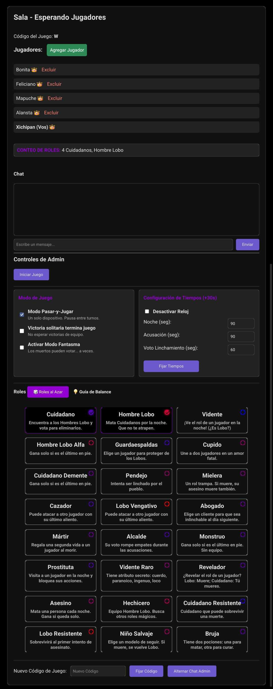
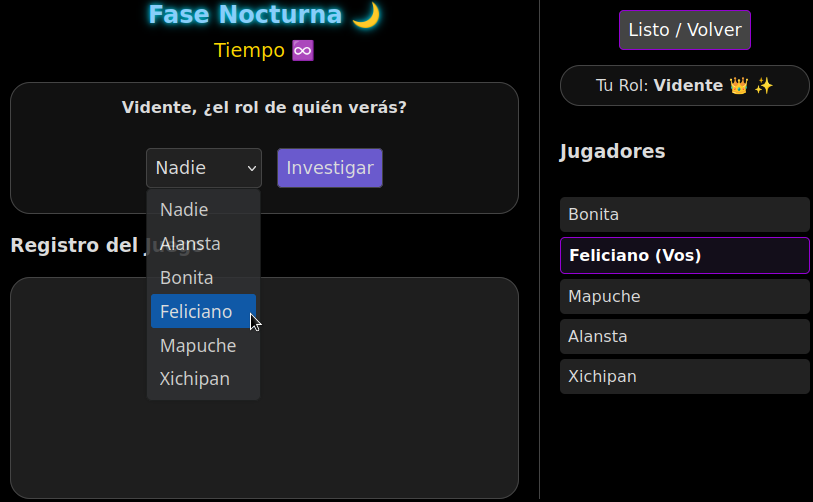
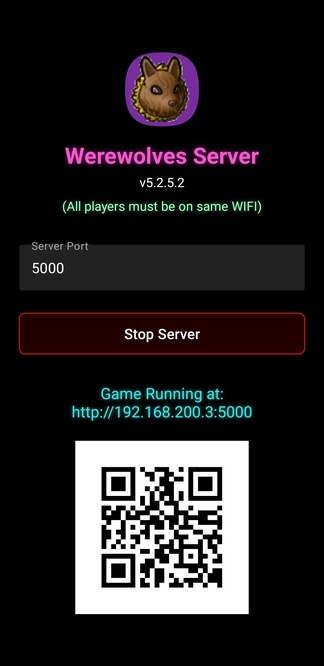

[🇺🇸 English](README.md) | [🇩🇪 Deutsch](README.de.md)

Un juego de deducción social multijugador en tiempo real, rico en funciones y
autoalojado. Construido con Python (Flask) y WebSockets, este proyecto ha
evolucionado desde un simple experimento hasta un juego de fiesta completamente
jugable que admite 24 roles únicos, soporte móvil para "Pasar-y-Jugar",
múltiples idiomas. [Instrucciones de Instalación](#configuración-y-ejecución) o
Descargar el programa del servidor para
[Linux(x86) y Android(apk)](https://github.com/davidchilin/werewolves_game/releases)

## **Descripción**

Este proyecto es una implementación web del clásico juego de fiesta
_Werewolves_. Los jugadores (mínimo 4, idealmente +7) se unen en una sala usando
un código de juego único, se les asignan roles secretamente (Cuidadano, Lobo o
Vidente), y luego pasan por fases de "noche" y "día". Durante la noche, los
lobos eligen secretamente a un jugador para eliminar, y el vidente puede
investigar el rol de un jugador. Durante el día, los jugadores discuten y votan
para linchar a alguien que sospechen de ser un lobo. El juego tiene
interacciones complejas: amantes vinculados por Cupido, muertes en cadena
(Mielera/Cazador), roles con victoria solitario (Asesino/Pendejo), y "Modo
Fantasma" donde los jugadores muertos aún pueden influir en el resultado.

El juego está diseñado para jugarse junto con un chat de video o voz separado
(como _Jitsi Meet_ o Zoom), donde la discusión y el engaño en tiempo real tienen
lugar, O en persona usando uno o varios dispositivos en modo **Pasar-y-Jugar**.

## **Características Principales**



- **📱 Modo Pasar-y-Jugar:** Juega con un solo teléfono (o varios) que se pasan
  por la habitación. La interfaz guía a los jugadores para confirmar su
  identidad antes de revelar su pantalla con rol privada.
- **👻 Modo Fantasma:** Los jugadores muertos no son solo espectadores. Si se
  habilita, los fantasmas tienen una pequeña probabilidad de participar durante
  la fase de acusación y voto de linchamiento.
- **🎭 24 Roles Únicos:** Incluyendo roles complejos como el **Lobo Alfa**,
  **Prostituta**, **Abogado** y **Asesino**.
- シ **Múltiples Idiomas:** Juega un solo juego en múltiples idiomas
  simultáneamente.
- **🏆 Victoria en Solitario:** Roles neutrales como el **Monstruo**, **Loco** o
  **Cuidadano Demente** pueden ganar solos, ignorando las lealtades del equipo.

- **Controles de Admin Robustos:** El primer jugador en unirse se convierte en
  el administrador y tiene la capacidad de:
  - Excluir jugadores de la sala.
  - Iniciar el juego una vez que se hayan unido suficientes jugadores (mínimo
    4).
  - Establecer duraciones personalizadas (en segundos) para las fases de Noche,
    Acusación y Voto de Linchamiento.
  - Establecer un nuevo código de juego.
  - Configurar chat solo para administradores.
  - Activar **Pasar-y-Jugar** y **Modo Fantasma**.
- **Sesiones Persistentes:** Los jugadores pueden actualizar su navegador o
  desconectarse momentáneamente sin perder su lugar en el juego (aunque el reloj
  podría ser incorrecto).
- **Actualizaciones del Juego y Chat en Vivo:** La interfaz se actualiza en
  tiempo real para todos los jugadores usando WebSockets, mostrando cambios de
  fase, estado del jugador, chat del juego y eventos del registro del juego.
- **Asignación Dinámica de Roles:** Al inicio del juego, a los jugadores se les
  asignan roles de forma aleatoria y secreta.
  - El botón "Roles al Azar" calcula una configuración equilibrada basada en
    pesos de roles (positivo para cuidadanos, negativo para lobos).
- **Juego Automatico y Condiciones de Victoria:** El juego cicla automáticamente
  a través de las fases. Después de cada muerte (por asesinato de lobo, un voto
  de linchamiento), el sistema verifica las condiciones de victoria:
  - **Ganan los Cuidadanos:** Cuando todos los lobos han sido eliminados.
  - **Ganan los Lobos:** Cuando el número de lobos vivos es igual o mayor que el
    número de no-lobos vivos.
  - **🏆 Condiciones de Victoria Solitario:** Roles neutrales como el
    **Monstruo**, **Loco** o **Cuidadano Demente** pueden ganar solos, ignorando
    las lealtades del equipo.
  - Cuando se cumple una condición de victoria, se muestra una pantalla de "Fin
    del Juego" a todos los jugadores, mostrando el equipo ganador, la razón de
    la victoria y una lista de todos los jugadores y sus roles finales.

## **Fases del Juego**


- **Fase Nocturna (Cronometrada):**

  - La fase termina cuando el tiempo se agota O todos los Lobos y el Vidente han
    enviado sus acciones.
  - Después de las acciones nocturnas, el juego verifica si se ha cumplido una
    condición ganadora antes de continuar.

- **Fase de Acusación (Cronometrada):**

  - La fase termina cuando el tiempo se agota O todos los jugadores vivos han
    hecho una acusación.
  - Los jugadores vivos votan para acusar a una persona.
  - Los fantasmas tienen un 25% de probabilidad de acusar.
  - Se muestra un recuento en vivo de acusaciones junto al nombre de cada
    jugador.
  - Lógica de Desempate: Si hay un empate para el jugador más acusado:
    - Si el empate es entre solo dos jugadores, no ocurre voto de linchamiento.
    - Si el empate es entre más de dos jugadores, la fase de acusación se
      reinicia una vez. Un segundo empate resulta en que no haya voto de
      linchamiento.

- **Fase de Voto de Linchamiento (Cronometrada):**

  - Si un solo jugador tiene la mayoría de acusaciones, comienza un juicio.
  - La fase termina cuando el tiempo se agota O todos los jugadores vivos han
    votado.
  - Los jugadores vivos votan "Sí" o "No" para linchar al jugador acusado. Se
    requiere una mayoría de votos "Sí". Los fantasmas tienen un 10% de
    probabilidad de votar durante el Voto de Linchamiento.
  - Si el tiempo expira, cualquier jugador que no haya votado por defecto vota
    "No".
  - Se muestra un resumen detallado de quién votó "Sí" y "No" en el registro del
    juego.
  - Después del voto, el juego verifica si se ha cumplido una condición ganadora
    antes de proceder a la noche.

- **Acciones Generales de la Fase de Día:** Los jugadores vivos pueden votar
  para terminar la fase de día temprano (mínimo 30 segundos) e iniciar el
  proceso de acusación. Si una mayoría elige dormir, el juego pasa a la noche.

## **Roles**

El juego ahora soporta **24 roles únicos**:

### 🌻 El Pueblo

- **Cuidadano:** Sin poderes. Deben trabajar juntos para encontrar y eliminar a
  todos los Hombres Lobo.
- **Vidente / Vidente Raro:** Investiga el rol de un jugador cada noche.
- **Guardaespaldas:** Protege a un jugador de la muerte por la noche.
- **Bruja:** Tiene una poción de **Curación** y una poción de **Veneno**.
- **Cazador:** Si muere, dispara a un objetivo de su elección.
- **Cupido:** Vincula a dos amantes. Si uno muere, el otro muere.
- **Alcalde:** Su voto cuenta como desempate. Puede nombrar un sucesor.
- **Prostituta:** Bloquea la habilidad de un jugador visitándolo.
- **Abogado:** Hace a un cliente inmune al Linchamiento al día siguiente.
- **Revelador:** Puede matar instantáneamente a un Lobo, pero muere si revela a
  un Cuidadano.
- **Mártir:** Otorga una "2da Vida" (armadura) a alguien al morir.
- **Cuidadano Resistente:** Sobrevive al primer intento contra su vida.
- **Niño Salvaje:** Elige un modelo a seguir. Si el modelo muere, se convierte
  en un Hombre Lobo.

### 🐺 La Manada

- **Hombre Lobo:** Deben trabajar con otros lobos para eliminar cuidadanos hasta
  tener la mayoría.
- **Lobo Alfa:** Gana solo si es el último lobo en pie.
- **Lobo Vengativo:** Un Lobo que actúa como un Cazador si muere.
- **Lobo Resistente:** Un Lobo con armadura (sobrevive un golpe).
- **Hechicero:** Trabaja con los lobos. Puede encontrar Videntes/Brujas pero no
  puede matar.

### 🎭 Neutral y Solitario (Caos)

- **Asesino:** Mata cada noche. Gana si es el último sobreviviente.
- **Pendejo:** Gana si consigue que lo Linchen.
- **Cuidadano Demente:** Parece bueno, pero gana si el pueblo es destruido.
- **Monstruo:** Inmune a ataques de Lobo. Gana si queda solo con 1 Lobo.
- **Mielera:** Si muere, el asesino muere (Venganza).



## **Configuración y Ejecución**

Para ejecutar este proyecto localmente, sigue estos pasos:

1.  **Clonar el repositorio:**

    ```bash
    git clone https://github.com/davidchilin/werewolves_game.git
    cd werewolves_game
    ```

    o descarga werewolves_game-master.zip y unzip en la carpeta werewolves_game.

2.  **Editar** el archivo `.env.werewolves`. Cambia _FLASK_SECRET_KEY_ a
    algo*largo_y_raro, \_CORS_ALLOWED_ORIGINS* a la dirección web deseada del
    juego como:
    http://127.0.0.1:5000,http://tu.ip.aqui:5000,https://tu.sitio.aqui:5000 O
    deja en blanco para deshabilitar CORS y usar cualquier sitio.

3.  **O BIEN** ejecutar vía Dockerfile (pasos 3A y 5) **O** a través de
    docker-compose (pasos 3B y 5) **O** instalar y ejecutar localmente (pasos
    3C-5).

    A. Construir docker y ejecutar. Puedes cambiar el puerto usado en el
    navegador a 8080 por ejemplo: -p 8080:5000.

    ```bash
    docker build -t werewolves_game .
    docker run -p 5000:5000 --name werewolves_game werewolves_game
    ```

    B. Construir docker compose y ejecutar.

    ```bash
    docker compose -f dockerfiles/docker-compose.yml up --build
    docker compose -f dockerfiles/docker-compose.yml up
    ```

    Para la versión de nginx docker compose: edita el archivo `.env.werewolves`:
    NGINX_PORT al puerto deseado (normalmente 5000) y server_name en nginx.conf

    ```bash
    docker compose -f dockerfiles/docker-compose-nginx.yml up --build
    docker compose -f dockerfiles/docker-compose-nginx.yml up
    ```

    C. Crear y activar un entorno virtual:

    - Windows:

      ```bash
      python -m venv venv
      .\venv\Scripts\activate
      ```

    - macOS / Linux:

      ```bash
      python3 -m venv venv
      source venv/bin/activate
      ```

4.  **Instalar Dependencias:**

    ```bash
    pip install Flask Flask-SocketIO python-dotenv
    ```

5.  **Ejecutar la App:**

    ```bash
    FLASK_APP=app.py flask run -h 0.0.0.0
    ```

    O alternativamente para mejor rendimiento y seguridad ejecuta el app Flask a
    través de tu GAME_PORT preferido y gunicorn:

    ```bash
    pip install gunicorn gevent
    export GAME_PORT=5001
    gunicorn --worker-class gevent -w 1 -b 0.0.0.0:$GAME_PORT app:app
    ```

    Y si usa LetsEncrypt para SSL, puede implementar gunicorn con SSL y copiar
    sus certificados con `deploy_certs.sh`, también actualizar `.env.werewolves`
    USE_HTTPS=false:

    ```bash
    sudo ./deploy_certs.sh cpu_user_name my.site.com
    export GAME_PORT=5001
    gunicorn --worker-class gevent -w 1 -b 0.0.0.0:$GAME_PORT   --certfile=./ssl_certs/fullchain.pem   --keyfile=./ssl_certs/privkey.pem   app:app
    ```

6.  **Acceder al juego:** Abre tu navegador web y ve a la dirección web y puerto
    del juego establecida en `.env.werewolves CORS_ALLOWED_ORIGINS`.
    Normalmente: `http://127.0.0.1:5000`. Abre múltiples pestañas o navegadores
    para simular diferentes jugadores uniéndose al juego. El Código de Juego
    Inicial es `W` y el primer jugador en unirse es el **Admin**.

### Configuración de Juego (config.py)

- DEFAULT_LANGUAGE: Configurar como "es" o "de" para cambiar el idioma en que
  empieza el servidor.
- TIME_NIGHT / TIME_ACCUSATION: Cambiar las duraciones predeterminadas (en
  segundos).
- PAUSE_DURATION: Segundos de pausa entre fases (para leer el texto).
- DEFAULT_ROLES: Qué roles se seleccionan automáticamente al iniciar el juego.

### Agrega tus Propios Roles

1. roles.py: Crea una clase que herede de Role. Define team, night_action, etc.
2. app.py: Importa tu nuevo rol y agrégalo al diccionario AVAILABLE_ROLES.
3. static/game.js: Agrega la role key (const) y actualiza los colores/íconos en
   updateRoleTooltip.
4. static/en.json (y otros): Agrega el nombre/descripción al objeto "roles".

### Agregar localización / Traducción de Idiomas

Para agregar tu idioma debe agregar un archivo de idioma, por ejemplo
static/de.json para Deutsch Y editar templates/index.html (agrege "option value"
y loginTranslations)

### Android App



Miralos en [Releases](https://github.com/davidchilin/werewolves_game/releases),
hecho con github action. Solo asegúrate de que todos los jugadores estén
conectados al mismo WIFI. Todos los archiivos para compilar en Android Studio
estan en la carpeta **android**. Mueve werewolves_game python, static,
templates, img a dentro de `android/app/src/main/python/`

### Licencia

Distribuido bajo la Licencia GNU GPL v3. Ver [LICENSE](LICENSE) para más
información.
