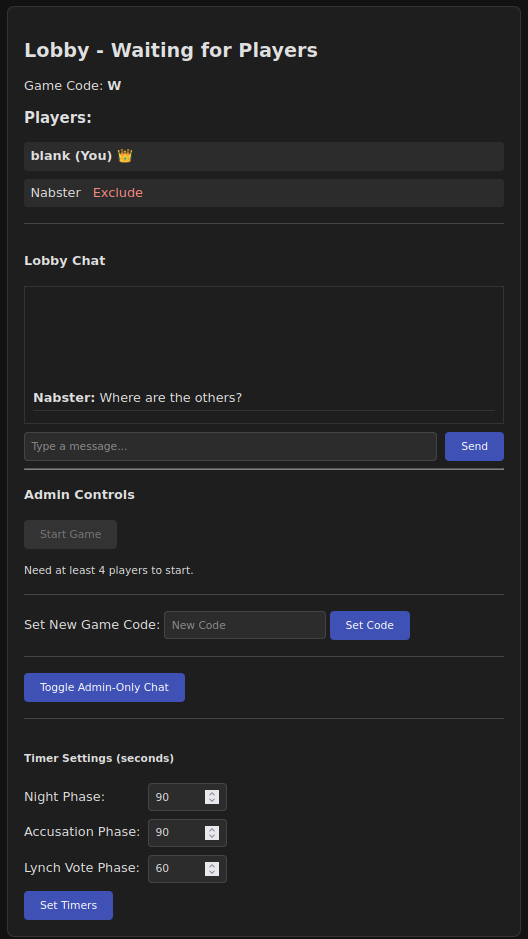

# **Werewolves - A Flask-based Multiplayer Game**

A self-hosted real-time multiplayer social deduction game inspired by Werewolves and Mafia. This web application is built primarily with Python, using the Flask framework and WebSockets for live player interaction. I made this game to practice using an LLM. [Install](#setup-and-running-the-project)

## **Description**

This project is a web-based implementation of the classic party game Werewolves. Players join a lobby using a unique game code, are secretly assigned roles (Villager, Wolf, or Seer), and then enter a cycle of "night" and "day" phases. During the night, wolves secretly choose a player to eliminate, and the seer can investigate a player's role. During the day, players discuss and vote to lynch someone they suspect is a wolf. The game is designed to be played alongside a separate video or voice chat (like Jitsi Meet or Zoom), where the real-time discussion and deception take place.

## **Core Features**



- **Secure Game Lobby:** Players join a single game instance using a shared game code.
- **Admin Controls:** The first player to join becomes the admin and has the ability to:
  - Exclude players from the lobby.
  - Start the game once enough players have joined (minimum of 4).
  - Set custom timer durations (in seconds) for the Night, Accusation, and Lynch Vote phases.
  - Set a new game code.
  - Set admin only chat.
- **Persistent Sessions:** Players can refresh their browser or momentarily disconnect without losing their place in the game (although timer might be incorrect)
- **Dynamic Role Assignment:** At the start of the game, players are randomly and secretly assigned one of three roles:
  - **Villager:** Must work to find and eliminate the wolves.
  - **Wolf:** Must work with other wolves to eliminate villagers until they have the majority.
  - **Seer:** A special villager who can investigate one player's role each night.
- **Live Game Updates and Chat:** The UI updates in real-time for all players using WebSockets, showing phase changes, player status, game chat, and game log events.
- **Automated Game Loop & Win Conditions:** The game automatically cycles through phases. After each death (from a wolf kill, a lynch vote) the system checks for win conditions:
  - **Villagers Win:** When all wolves have been eliminated.
  - **Wolves Win:** When the number of living wolves is equal to or greater than the number of living non-wolves.
- **Game Over & Rematch System:**
  - When a win condition is met, a "Game Over" screen is displayed to all players, showing the winning team, the reason for victory, and a list of all players and their final roles.
  - From the Game Over screen, players can chat and vote to "Return to Lobby". Once a majority is reached, the game state is reset, and all players are automatically redirected to the lobby to start a fresh game with the same group.
- **Dark Mode UI:** A clean, modern dark theme for comfortable gameplay.

## **Game Phases**


- **Night Phase (Timed):**

  - Phase ends when either the timer runs out OR all Wolves and the Seer have submitted their actions.
  - **Wolves:** Secretly vote to kill a player. A kill only succeeds if all living wolves vote unanimously for the same player.
  - **Seer:** Investigates one player's role each night. The result is shown only to the seer.
  - **Villagers:** Can subtly cast suspision on a player.
  - After the night's actions, the game checks if a winning condition has been met before proceeding.

- **Accusation Phase (Timed):**

  - Phase ends when either the timer runs out OR all living players have made an accusation.
  - Living players vote to accuse one person.
  - A live tally of accusations is displayed next to each player's name.
  - Tie-Breaking Logic: If there is a tie for the most accused player:
    - If the tie is between only two players, no lynch vote occurs.
    - If the tie is among more than two players, the accusation phase is
      restarted once. A second tie results in no lynch vote.

- **Lynch Vote Phase (Timed):**

  - If a single player has the most accusations, a trial begins.
  - Phase ends when either the timer runs out OR all living players have voted.
  - Living players vote "Yes" or "No" to lynch the accused player. A majority "Yes" vote is required.
  - If the timer expires, any non-voting player defaults to a "No" vote.
  - A detailed summary of who voted "Yes" and "No" is displayed in the game log.
  - After the vote, the game checks if a winning condition has been met before proceeding to the night.

- **General Day Phase Actions:** Living players can vote to end the day phase early (minimum 30 seconds) and start the accusation process. If a majority choose sleep, the game transitions to night.


## **Tech Stack**

- **Backend:** Python 3.10 - Flask, gunicorn, gevent
- **Real-time Communication:** Flask-SocketIO
- **Frontend:** Jinja2 for server-side templating, with vanilla HTML, CSS, and JavaScript for client-side interactivity.

## **Setup and Running the Project**

To run this project locally, follow these steps:

1.  **Clone the repository:**
    ```bash
    git clone [https://github.com/davidchilin/werewolves_game.git](https://github.com/davidchilin/werewolves_game.git)
    cd werewolves_game
    ```

2. **EITHER** run via Dockerfile (steps 2A & 5) **OR** through docker-compose (steps 2B & 5) **OR** install and run locally (steps 2C-5). **Edit** `.env.werewolves` file: FLASK_SECRET_KEY to_something_long_random, CORS_ALLOWED_ORIGINS to desired game web address http://127.0.0.1:5000,http://your.ip.here:5000,https://your.site.here:5000.
```markdown
    A. Build docker and run. Can change port used in browser to 8080 for example: -p 8080:5000.   
        - `docker build -t werewolves_game .`
        - `docker run -p 5000:5000 --name werewolves_game werewolves_game`
    B. Build docker compose and run.
        - `docker compose up --build`
        - `docker compose up`
        For nginx docker compose version: edit `.env.werewolves` file: NGINX_PORT to desired port (default 5000) and server_name in nginx.conf
        - `docker compose -f ./docker-compose-nginx.yml up --build`
    C. Create and activate a virtual environment:
        - Windows: `python -m venv venv` followed by `.\venv\Scripts\activate`
        - macOS / Linux: `python3 -m venv venv` followed by `source venv/bin/activate`
```

3.  **Install the required dependencies:**

    ```bash
    pip install Flask Flask-SocketIO python-uuid python-dotenv
    ```

4.  **Run the Flask application:**

    ```bash
    FLASK_APP=app.py flask run -h 0.0.0.0
    ```
    OR alternatively for better performance and security run the Flask app through gunicorn:
    ```bash
    pip install gunicorn gevent
    gunicorn --worker-class gevent -w 1 -b 0.0.0.0:5000 app:app
    ```

5.  **Access the game:** Open your web browser and go to game web address set in `.env.werewolves CORS_ALLOWED_ORIGINS`. Defaults: `http://127.0.0.1:5000`. Open multiple tabs or browsers to simulate different players joining the game. Initial Game Code is `W`

## **Project Roadmap**

With the core gameplay loop complete, future development will focus on adding depth and improving the user experience.

- **Future Enhancements (Planned):**
  - **Additional Roles:** Introduce new roles like the Doctor, Hunter, or Witch.
  - **Enhanced UI/UX:** Improve the user interface with more visual cues, animations, and sound effects for a more immersive experience. during certain phases.
  - **Spectator Mode:** Allow users to join a game as a non-participating spectator.
  - **Single Phone Mode:** Allow a game to be guided by moderator and passing around a single phone.
