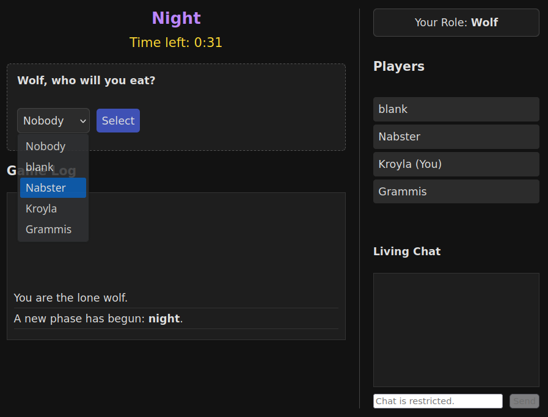

[🇬🇹 Español](README.es.md) | [🇩🇪 Deutsch](README.de.md)

# **Werewolves Game**

A feature-rich, self-hosted real-time multiplayer social deduction game. Built
with Python (Flask) and WebSockets, this project has evolved from a simple
experiment into a fully playable party game supporting 24 unique roles, mobile
"Pass-and-Play" support, multiple languages, and complex win conditions.
[Install Instructions](#setup-and-running-the-project)

## **Description**

This project is a web-based implementation of the classic party game Werewolves.
Players (minimum of 4, ideally +7) join a lobby using a unique game code, are
secretly assigned roles (Villager, Wolf, or Seer), and then cycle through
"night" and "day" phases. During the night, wolves secretly choose a player to
eliminate, and the seer can investigate a player's role. During the day, players
discuss and vote to lynch someone they suspect is a wolf. The game supports
complex interactions: lovers linked by Cupid, chain-reaction deaths
(Honeypot/Hunter), solo-winning roles (Serial Killer/Fool), and "Ghost Mode"
where dead players can still influence the outcome.

The game is designed to be played alongside a separate video or voice chat (like
_Jitsi Meet_ or Zoom), where the real-time discussion and deception take place
OR in person using one to several devices in **Pass-and-Play** mode.

## **Core Features**


- **📱 Pass-and-Play Mode:** Play with a single phone (or several) passed around
  the room. The UI guides players to confirm their identity before revealing
  their private role screen.
- **👻 Ghost Mode:** Dead players aren't just spectators. If enabled, ghosts
  have a small chance to participate during accusation and lynch vote phase.
- **🎭 24 Unique Roles:** Including complex roles like the **Alpha Werewolf**,
  **Prostitute**, **Lawyer**, and **Serial Killer**.
- シ **Multiple Language** - Play a single game in multiple languages
  simultaneously.
- **🏆 Solo Win Conditions:** Neutral roles like the **Monster**, **Fool**, or
  **Demented Villager** can win alone, ignoring team allegiances.

- **Robust Admin Controls:** The first player to join becomes the admin and has
  the ability to:
  - Exclude players from the lobby.
  - Start the game once enough players have joined (minimum of 4).
  - Set custom timer durations (in seconds) for the Night, Accusation, and Lynch
    Vote phases.
  - Set a new game code.
  - Set admin only chat.
  - Turn on **Pass-and-Play** and **Ghost Mode**.
- **Persistent Sessions:** Players can refresh their browser or momentarily
  disconnect without losing their place in the game (although timer might be
  incorrect)
- **Live Game Updates and Chat:** The UI updates in real-time for all players
  using WebSockets, showing phase changes, player status, game chat, and game
  log events.
- **Dynamic Role Assignment:** At the start of the game, players are randomly
  and secretly assigned roles.
  - "Random Roles" button calculates a balanced setup based on role weights
    (positive for villagers, negative for wolves).
- **Automated Game Loop & Win Conditions:** The game automatically cycles
  through phases. After each death (from a wolf kill, a lynch vote) the system
  checks for win conditions:
  - **Villagers Win:** When all wolves have been eliminated.
  - **Wolves Win:** When the number of living wolves is equal to or greater than
    the number of living non-wolves.
  - **🏆 Solo Win Conditions:** Neutral roles like the **Monster**, **Fool**, or
    **Demented Villager** can win alone, ignoring team allegiances.
  - When a win condition is met, a "Game Over" screen is displayed to all
    players, showing the winning team, the reason for victory, and a list of all
    players and their final roles.

## **Game Phases**


- **Night Phase (Timed):**

  - Phase ends when either the timer runs out OR all Wolves and the Seer have
    submitted their actions.

  - After the night's actions, the game checks if a winning condition has been
    met before proceeding.

- **Accusation Phase (Timed):**

  - Phase ends when either the timer runs out OR all living players have made an
    accusation.
  - Living players vote to accuse one person.
  - Ghost have a 25% chance to accuse.
  - A live tally of accusations is displayed next to each player's name.
  - Tie-Breaking Logic: If there is a tie for the most accused player:
    - If the tie is between only two players, no lynch vote occurs.
    - If the tie is among more than two players, the accusation phase is
      restarted once. A second tie results in no lynch vote.

- **Lynch Vote Phase (Timed):**

  - If a single player has the most accusations, a trial begins.
  - Phase ends when either the timer runs out OR all living players have voted.
  - Living players vote "Yes" or "No" to lynch the accused player. A majority
    "Yes" vote is required. Ghost have a 10% chance to vote during Lynch Vote.
  - If the timer expires, any non-voting player defaults to a "No" vote.
  - A detailed summary of who voted "Yes" and "No" is displayed in the game log.
  - After the vote, the game checks if a winning condition has been met before
    proceeding to the night.

- **General Day Phase Actions:** Living players can vote to end the day phase
  early (minimum 30 seconds) and start the accusation process. If a majority
  choose sleep, the game transitions to night.

## **Roles**

The game now supports **24 unique roles**:

### 🌻 The Village

- **Villager:** No powers. Must work together to find and eliminate all the
  Werewolves.
- **Seer / Random Seer:** Investigates one player's role each night.
- **Bodyguard:** Protects one player from death at night.
- **Witch:** Has one **Heal** potion and one **Poison** potion.
- **Hunter:** If killed, shoots a target of their choice.
- **Cupid:** Links two lovers. If one dies, the other dies.
- **Mayor:** Their vote counts as tie-breaker. Can appoint a successor.
- **Prostitute:** Blocks a player's ability by visiting them.
- **Lawyer:** Makes a client immune to Lynching the next day.
- **Revealer:** Can instantly kill a Wolf, but dies if they reveal a Villager.
- **Martyr:** Grants a "2nd Life" (armor) to someone upon dying.
- **Tough Villager:** Survives the first attempt on their life.
- **Wild Child:** Picks a role model. If the model dies, becomes a Werewolf.

### 🐺 The Pack

- **Werewolf:** Must work with other wolves to eliminate villagers until they
  have the majority.
- **Alpha Werewolf:** Wins only if they are the last wolf standing.
- **Backlash Werewolf:** A Wolf that acts like a Hunter if killed.
- **Tough Werewolf:** A Wolf with armor (survives one hit).
- **Sorcerer:** Works with wolves. Can find Seers/Witches but cannot kill.

### 🎭 Neutral & Solo (Chaos)

- **Serial Killer:** Kills every night. Wins if they are the last survivor.
- **Fool:** Wins if they get themselves Lynched.
- **Demented Villager:** Appears good, but wins if the village is destroyed.
- **Monster:** Immune to Wolf attacks. Wins if left alone with 1 Wolf.
- **Honeypot:** If killed, the killer dies (Retaliation).



## **Setup and Running**

To run this project locally, follow these steps:

1.  **Clone the repository:**

    ```bash
    git clone https://github.com/davidchilin/werewolves_game.git
    cd werewolves_game
    ```

    or download werewolves_game-master.zip and unzip to folder werewolves_game.

2.  **Edit** `.env.werewolves` file. Change _FLASK_SECRET_KEY_ to
    something_long_random, _CORS_ALLOWED_ORIGINS_ to desired game web address
    like:
    http://127.0.0.1:5000,http://your.ip.here:5000,https://your.site.here:5000
    OR leave blank to disable CORS and use any site.

3.  **EITHER** run via Dockerfile (steps 3A & 5) **OR** through docker-compose
    (steps 3B & 5) **OR** install and run locally (steps 3C-5).

    A. Build docker and run. You can change port used in browser to 8080 for
    example: -p 8080:5000.

    ```bash
    docker build -t werewolves_game .
    docker run -p 5000:5000 --name werewolves_game werewolves_game
    ```

    B. Build docker compose and run.

    ```bash
    docker compose up --build
    docker compose up
    ```

    For nginx docker compose version: edit `.env.werewolves` file: NGINX_PORT to
    desired port (default 5000) and server_name in nginx.conf

    ```bash
    docker compose -f ./docker-compose-nginx.yml up --build
    ```

    C. Create and activate a virtual environment:

    - Windows:

      ```bash
      python -m venv venv
      .\venv\Scripts\activate
      ```

    - macOS / Linux:
      ```bash
      python3 -m venv venv
      source venv/bin/activate
      ```

4.  **Install Dependencies:**

    ```bash
    pip install Flask Flask-SocketIO python-dotenv
    ```

5.  **Run the App:**

    ```bash
    FLASK_APP=app.py flask run
    ```

    OR alternatively for better performance and security run the Flask app
    through your preferred GAME_PORT and gunicorn:

    ```bash
    pip install gunicorn gevent
    export GAME_PORT=5001
    gunicorn --worker-class gevent -w 1 -b 0.0.0.0:$GAME_PORT app:app
    ```

    AND if you use LetsEncrypt for SSL, you can deploy gunicorn with SSL, and
    copy your certificates with `deploy_certs.sh`, also update `.env.werewolves`
    USE_HTTPS=true:

    ```bash
    sudo ./deploy_certs.sh cpu_user_name my.site.com
    export GAME_PORT=5001
    gunicorn --worker-class gevent -w 1 -b 0.0.0.0:$GAME_PORT   --certfile=./ssl_certs/fullchain.pem   --keyfile=./ssl_certs/privkey.pem   app:app
    ```

6.  **Access the game:** Open your web browser and go to game web address and
    port set in `.env.werewolves CORS_ALLOWED_ORIGINS`. Defaults:
    `http://127.0.0.1:5000`. Open multiple tabs or browsers to simulate
    different players joining the game. Initial Game Code is `W` and first
    player to join is **Admin**.

### Configureation (config.py)

- DEFAULT_LANGUAGE: Set to "es" or "de" to change the server default.
- TIME_NIGHT / TIME_ACCUSATION: Change default durations (seconds).
- PAUSE_DURATION: Seconds to pause between phases (to read text).
- DEFAULT_ROLES: Which roles are auto-selected on a fresh boot.

### Add Your Own Roles

1. roles.py: Create a class inheriting from Role. Define team, night_action,
   etc.
2. app.py: Import your new role and add it to AVAILABLE_ROLES dict.
3. static/game.js: Add the role key (const) and update updateRoleTooltip
   colors/icons.
4. static/en.json (and others): Add name/description to "roles" object.

License

Distributed under the GNU GPL v3 License. See [LICENSE](LICENSE) for more
information.
